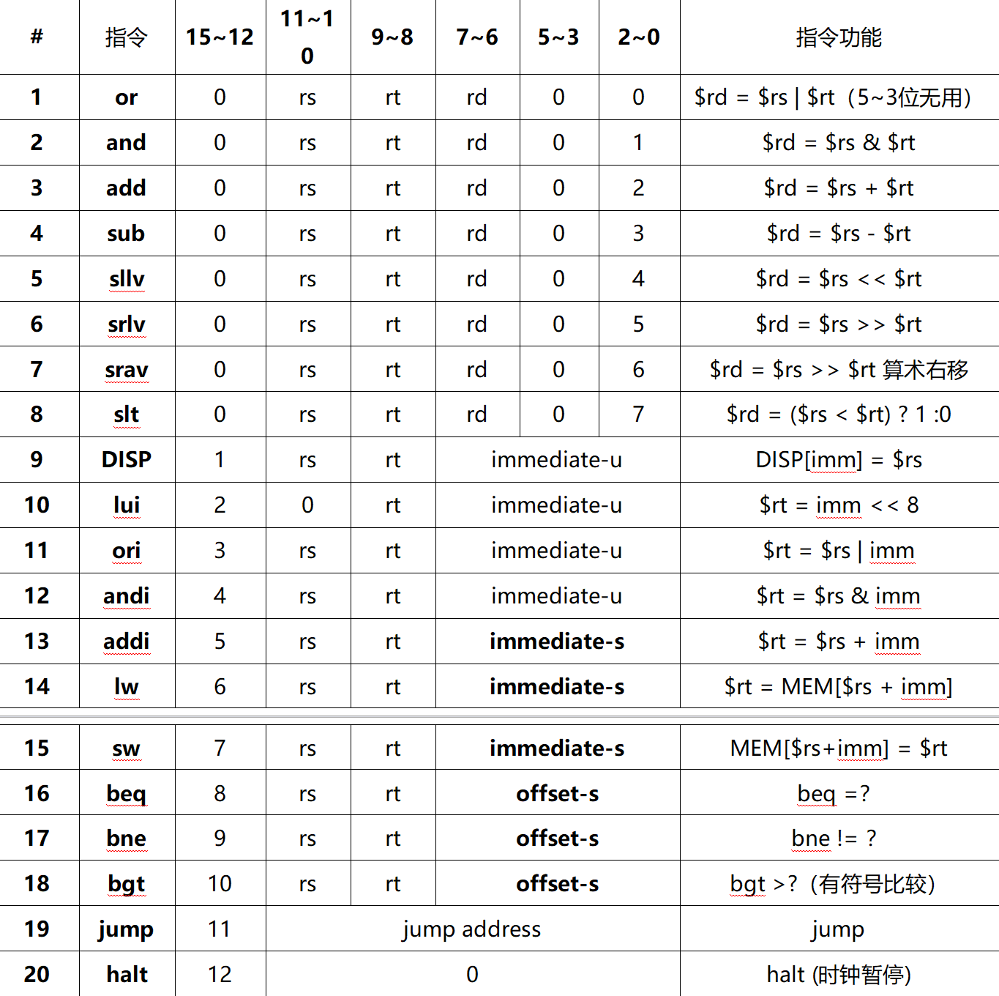

# Quartus-CPU

> 基于 FPGA 的单周期 CPU 设计与实现

## 项目简介

设计单周期 CPU，支持下图中的所有指令

## 文档

详细的项目需求和实现说明请参阅：

- [课程设计上手指南](docs/startup.md)
- [DE1-Soc 开发板手册](https://github.com/Royfor12/CQUT-Course-Guide-Sharing-Scheme/blob/main/%E8%AF%BE%E7%A8%8B%E7%9B%AE%E5%BD%95/%E8%AE%A1%E7%AE%97%E6%9C%BA%E7%BB%84%E6%88%90%E5%8E%9F%E7%90%86/%E5%AE%9E%E9%AA%8C/DE1-SoC_User_Manual.pdf)

## 许可

本项目使用开源许可证 - 详见 [LICENSE](LICENSE)
