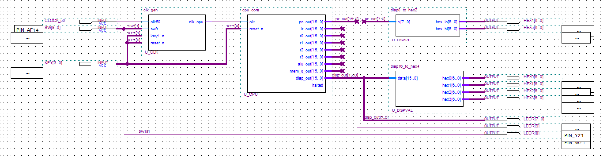
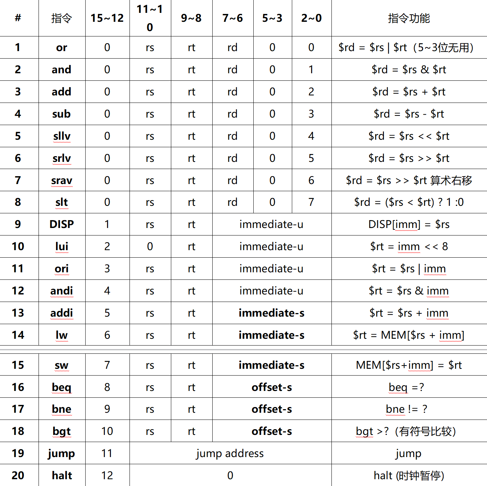

# 课程设计上手指南

## VHDL

任务书要求使用 Verilog 或 VHDL 完成设计。

Verilog 和 VHDL 都是硬件描述语言，顾名思义，它们用于描述数字电路的结构和行为。

在 Quartus 中，我们可以将硬件描述语言转换为符号图(.bsf)，也就是前面实验中 `Create Symbol Files from Current File` 的步骤，一个符号图相当于一个封装好的模块。当我们拥有多个符号图时，可以通过"画图“的方式将模块连接起来形成更复杂的电路，也就是顶层设计文件(.bdf)。

虽然我们使用“画图”的方式进行顶层设计，但顶层设计文件(.bdf)的背后，本质上仍是字符串编码的非二进制文件（不信你用微软大战代码打开看看），在进行全编译时，也需要链接各个模块的 VHDL 代码。因此，整个项目的根基仍然是硬件描述语言编写的模块文件。

说了这么多看似不相干的，但我要表达的意思是，**顶层设计文件与 VHDL 代码是等价的**，你可以自由选择和控制封装的层级——代码越复杂，封装的模块就越多，顶层设计文件就越简单；反之亦然。在此课设中，我选择了最高级的封装层级以减少顶层的连接（因为连线经常编译不通过，位宽怎么改都不匹配，放弃了）。

下图为此课设的顶层设计文件截图，可以看到并没有想象中的复杂：



相较于 Verilog，VHDL 的语法更加复杂。但介于前面的实验均使用 VHDL，这里就继续使用 VHDL 完成。

为了介绍此课设的代码，下面不得不简单介绍 VHDL 的语法和结构：

VHDL 的基本单位为 `Entity`（实体），每个实体可以包含多个 `Architecture`（结构体）。
`Entity` 定义了 **“这个模块对外长什么样”** ，也就是 `端口`（输入/输出）和一些可配置参数；
`Architecture` 定义了 **“这个模块内部是如何实现的”**，也就是具体的逻辑电路。

下面给出了一个简单的 VHDL 模块示例：

```vhdl
-- 这里是一些库的引用，就像 C 语言的头文件一样
library ieee;
use ieee.std_logic_1164.all;
use ieee.numeric_std.all;

-- 开头的 entity 表示这是一个模块实体，内部定义了端口(port)
entity simplemodule is
  port (
    -- std_logic 表示单比特信号
    clk   : in  std_logic;
    rst_n : in  std_logic;
    -- std_logic_vector 表示多比特信号，也就是总线
    -- 7 downto 0 表示这是一个 8 位总线，位编号从 7 到 0，与顶层设计文件(.bdf)中[7..0]的含义是一致的
    a     : in  std_logic_vector(7 downto 0);
    y     : out std_logic_vector(7 downto 0)
  );
end entity;

-- 开头的 architecture 表示这是模块内部电路的具体实现方式
architecture rtl of simplemodule is
  -- 声明内部信号
  -- 可以理解为模块内部的连线，也可以当作临时变量
  signal tmp : std_logic_vector(7 downto 0);
begin
  -- 并发语句
  -- 此语句可视为将输入端口 a 的值赋给内部信号 tmp
  tmp <= a;

  -- 进程块：用来写电路的组合/时序逻辑
  process(clk)
  begin
    -- 若时钟为上升沿，将 tmp 的值赋给输出端口 y
    if rising_edge(clk) then
      y <= tmp;
    end if;
  end process;
end architecture;

-- 整个模块的功能为：在时钟上升沿时，将输入 a 的值传递到输出 y，是不是很好理解？
```

简略了解 VHDL 语法后，看看这个项目应该怎么起手：

## 《任务书》要求

> 基于 FPGA 的单周期 CPU 设计与实现。

1. 指令格式表

2. 支持表中至少 10 条指令。至少包含 1 条寄存器指令，1 条立即数指令，1 条读存储器 lw 指令，1 条写存储器 sw 指令，1 条有条件跳转指令，1 条无条件转移 jump 指令和 1 条停机指令。
3. 能运行由自己所设计的指令系统构成的一段测试程序，测试程序应能涵盖所有指令，程序执行功能正确。

## 如何起手？

将上述需求总结一下：设计一个单周期 CPU，能支持表中的指令，根据表中指令写一个测试程序，确保程序执行正确。

### 指令从哪来？

在计算机中，我们运行的各种程序本质上是一系列指令的集合。当我们运行硬盘中的程序时，计算机会将该程序（也就是指令）从硬盘加载到内存中。然后 CPU 从内存查找要执行的指令。

### 如何执行指令？

先别管表中的指令究竟是什么含义。最关键的问题是：CPU 是如何执行指令的？这就得从 CPU 的基本组成结构说起。

虽然平时我们买到的 CPU 都是一大块芯片，但实际上CPU并非一个单一的整体，其内部由多个专门的逻辑单元组成：

1. 控制单元 (Control Unit)
CPU 的指挥中心。它负责从内存中读取指令，并对指令进行分析，然后根据指令的要求，命令其他部件进行相关操作。

2. 算术逻辑单元 (ALU)
负责执行所有的数学运算（加、减、乘、除）和逻辑运算（与、或、非、比较大小等）。

3. 寄存器组 (Registers)
CPU 内部用于临时存储数据的高速存储单元。它们用于暂时存放：
   - 待处理的数据
   - 指令的内存地址（PC 寄存器，也称程序计数器）
   - 正在执行的指令（IR 寄存器，也称指令寄存器）
   - 中间运算结果

4. 内部总线 (Internal Bus)
CPU内部各组件之间传输信号和数据的高速公路

介绍完了 CPU 的基本组成结构，接下来看看 CPU 是如何执行指令的。一条指令的执行被拆分成如下步骤：

1. 取指令(IF)
    - 【PC 寄存器】指针状态更新
    - CPU 根据【PC 寄存器】指针的内存地址，从 RAM 中取出指令
    - 递增器会计算 PC + 当前指令长度，将下一条指令的地址存入暂存器（此时指针未更新）
    - 该指令存储到【IR 寄存器】中

2. 指令译码(ID)
    【控制单元】对存放在【IR 寄存器】中的指令进行如下解析：
    - 根据指令中的寄存器索引，从【寄存器组】中读取数据作为操作数
    - 如果指令中带有常数（立即数），【控制单元】会将其转换为 CPU 的位宽作为操作数
    - 根据指令类型，生成相应的控制信号

3. 执行(EX)
    - 【算术逻辑单元 ALU】接收到操作数和控制信号，进行逻辑运算、算术运算或移位
    - 如果是访问内存的指令，ALU 在此阶段计算出目标物理地址

4. 访存(MEM)
若上述指令涉及到内存操作（加载或存储数据），则执行此步骤。
    - Load：读取【执行阶段】计算出的地址数据，并存储到临时寄存器中
    - Store：将【译码阶段】获取的的操作数写入目标内存地址

5. 写回(WB)
    - 将执行阶段产生的“计算结果”或访存阶段得到的“内存数据”写回到目标寄存器中

6. 提交与更新【此处不介绍】

在上述执行指令的所有阶段中，**完成所有阶段所需的总时间决定了 CPU 执行一条指令所需的时间，也称为指令周期**。

CPU 内部的各个模块根据时钟驱动电路产生的信号进行协同工作。时钟信号每震荡一次，电路中的状态寄存器更新一次，称为一个时钟周期，是 CPU 工作的最小时间单位。时钟周期与 CPU 主频互为倒数：时钟周期越短，CPU 主频越高。

时钟周期的长度是人为设定的，可以很长，也可以很短。

为了提高性能，现代 CPU 往往需要支持多条指令重叠执行，这同时也要求状态寄存器进行快速变化，因此，现代 CPU 的时钟周期通常较短，完成整个指令执行阶段需要多个时钟周期。

> 何谓“重叠执行”？可以理解为一条相同长度的流水线上，只有一个产品，和有多个产品同时在不同工位上的区别。显然，后者的效率更高。

而对于本课设的单周期 CPU，其核心概念是：**上一条指令执行完成后，才执行下一条指令，电路中的状态寄存器只需要更新一次**。因此，单周期 CPU 使用一个时钟周期就能完成整个指令的执行步骤。在这种设计下，**时钟周期 = 指令周期**。

同时，由于时钟周期一般是固定的，这就意味着单周期 CPU 的时钟周期必须必须等于**耗时最长指令**的全过程时间。不过，在此课设中不必担心这个问题，因为我们设定的 CPU 频率只有 50MHz（时钟周期 20ns），足够支持表中所有指令的完整执行。

了解了 CPU 的基本组成结构和指令执行流程后，我们得以明确组成一个单周期 CPU 需要哪些模块

1. PC 寄存器
2. 内部总线
3. 控制单元
4. 寄存器组
5. 算数逻辑单元

知道需要哪些模块后，还应当明确模块的设计需求，例如位宽、寄存器数量等。这就需要通过解读任务书中的指令格式表来实现。


重新审视这张指令格式表，解读每一条指令的含义。

### 指令表解读

【指令功能】列：
$ 表示取出该寄存器里的数值，rs、rt、rd 都是寄存器的名称。

- rs: 源寄存器（数据来源）
- rt: 目标寄存器（有时也是数据来源）
- rd: 目的寄存器（通常存放最终计算结果）
- imm: 立即数，指令中直接给出的常数
- MEM[...]: MEM 代表内存，[...]为内存地址
- DISP[...]: 输出到显示寄存器，[...]为寄存器数组索引
- +, -：加法，减法
- |：按位或 (OR)。只要有一个是1，结果就是1
- &：按位与 (AND)。两个都是1，结果才是1
- <<：左移。二进制位向左移动，相当于乘以2
- \>>：右移。二进制位向右移动，相当于除以2
- ? 1 : 0：条件判断。如果问号前的条件成立，结果为1，否则为0
- immediate-u：无符号数。把这个二进制数当成正整数看
- immediate-s / offset-s：有符号数。最高位是符号位，代表这个数可能是负数

有了以上信息，我们可以尝试解读每一条指令：

#### 寄存器运算类指令 (R-Type)

> 这类指令的特点是：完全在 CPU 内部操作，从两个寄存器拿数据，算出结果放回另一个寄存器

1. or【按位或】
2. and【按位与】
3. add【加法】
4. sub【减法】
5. sllv【逻辑左移】: 将寄存器 rs 中的二进制位向左移动，移动的位数由寄存器 rt 中的数值决定。右边空出的位补 0。结果存入 rd
6. srlv【逻辑右移】: 将寄存器 rs 中的二进制位向右移动，移动的位数由寄存器 rt 决定。左边空出的位补 0（用于无符号数处理）。结果存入 rd
7. srav【算术右移】: 与逻辑右移类似，但是左边空出的位补充符号位（原来最高位是1就补1，是0就补0）。这是为了保证负数在右移后依然是负数
8. slt【小于置位】: 比较 rs 和 rt 的大小。如果 rs 小于 rt，则将寄存器 rd 设置为 1；否则设置为 0

#### 立即数与内存访问类指令 (I-Type)

> 这类指令的特点是：引入了一个常数（立即数），用于计算、赋值或与内存交互

1. DISP【输出到显示器】: 将寄存器 rs 中的数据，写入到由立即数 imm 指定的显示设备地址
2. lui【加载高位立即数】: 将指令中给出的立即数 imm 放入寄存器 rt 的高 8 位，并将低 8 位清零，实现将一个 8 位常数扩展为 16 位的效果
3. ori【立即数按位或】: 将寄存器 rs 的值与指令中给出的立即数 imm 进行“或”运算，结果存入寄存器 rt
4. andi【立即数按位与】
5. addi【立即数加法】
6. lw【读取内存】: 用寄存器 rs 的值加上立即数 imm，得到一个内存地址。从该内存地址中读取数据，并将数据存入寄存器 rt
7. sw【写入内存】: 用寄存器 rs 的值加上立即数 imm，得到一个内存地址。将寄存器 rt 中的数据写入到该内存地址中

#### 跳转与分支类指令 (J-Type)

> 这类指令的特点是：改变程序的执行流，让程序不再按顺序往下走，而是跳到别的地方

1. beq【相等跳转】: 比较寄存器 rs 和 rt 的值。如果两者相等，程序就跳转到由偏移量 offset 指定的位置继续执行；如果不等，则继续执行下一条
2. bne【不等跳转】: 与 beq 相反。如果 rs 和 rt 不相等，程序就跳转到 offset 指定的位置；如果相等，则继续执行下一条
3. bgt【大于跳转】: 对寄存器 rs 和 rt 进行有符号比较。如果 rs 的值大于 rt 的值，程序就跳转到 offset 指定的位置；否则继续执行下一条
4. jump【无条件跳转】: 不需要任何条件，直接强制程序跳转到指令中给出的具体地址 (jump address)
5. halt【停机】: 时钟暂停，程序停止执行

> 注意：此工程中的停机逻辑并非字面意义的时钟暂停，而是通过控制单元发出停止信号，阻止寄存器堆更新，从而让 CPU 停止执行后续指令。若将时钟真正掐断，KEY0 的复位操作将会非常麻烦（复位后不会继续工作，而任务书中并没有提供唤醒方式）。

### 模块设计需求分析

这张表描述了一个16位 CPU 的指令集架构，顾名思义指令由16位二进制数组成，因此，**所有模块（包括总线）的位宽都可以设计为16位**。

【指令码】列：

- 15~12 (操作码): 区分指令的类别
- 11\~10、9\~8、7\~6 (寄存器索引): 寄存器编号。二进制的 2 位只能表示4个数，意味着 **CPU 最多只有 4 个通用寄存器**
- 5~3: R-Type 下无用
- 2~0 (功能码): 进一步区分 R-Type 指令的具体操作，例如 add、sub、and、or 等
- 7\~0 (立即数/偏移量): 8 位二进制数，可以表示的无符号数范围为 0\~255，有符号数范围为 -128~127
- 11~0: jump【无条件跳转】下的具体地址，halt【停机】置0

指令位宽与数据通路主位宽：分析已给出  
寄存器数量：分析已给出  
立即数扩展：在指令中，立即数落在低 8 位，因此需要**扩展为系统的 16 位**。由 immediate-u 和 immediate-s 字段可得同时也需要设计**符号扩展和零扩展**。  

将以上需求整理后，就可以得出我们需要的模块，同时给出对应的代码文件：

1. PC 寄存器 -> cpu_core.vhd
2. 内部总线 -> cpu_core.vhd
3. 控制单元 -> control_unit.vhd
4. 寄存器组 -> regfile4x16.vhd
5. 算数逻辑单元 -> alu16.vhd
6. 存储器1：数据 RAM -> data_ram16.vhd
7. 存储器2：指令 ROM -> instr_rom16.vhd
8. 附加模块（立即数扩展等）-> cpu16_pkg.vhd

由于 cpu_core.vhd 封装了较多模块，下面先介绍独立模块的设计思路。

## 模块实现

### 附加模块 cpu16_pkg.vhd

cpu16_pkg.vhd 的实现思路就是把指令编码和立即数扩展函数集中到一个包中，作为全工程的唯一源，从而保证控制单元、ALU、数据通路对指令系统的理解完全一致。因此，本模块的任务主要是存放一些常量和立即数扩展函数，方便在其他模块中调用。

上文已经推导了指令各段的阅读方式，由此可以直接区分并命名常量。

但此外我们还需要定义一套 ALU 内部控制编码，映射至【R-type 功能码】，用于 ALU 内部使用运算逻辑。例如，实现 addi/lw/sw 指令都需要 ADD 运算，若将指令再拆成其它指令会更加麻烦。

同时还需要定义写回来源。由任务书可知，写回来源有有三类来源：

- ALU 结果写回：R 型、ori/andi/addi 等（$rt 或 $rd = 运算结果）
- 内存读数据写回：lw（$rt = MEM[...]）
- LUI 专用写回值：lui（$rt = imm << 8）

```vhdl
library ieee;
use ieee.std_logic_1164.all;
use ieee.numeric_std.all;

package cpu16_pkg is
  -------------------- 操作码（IR[15:12]）---------------------
  -- R-type 指令
  constant OP_RTYPE : std_logic_vector(3 downto 0) := "0000";
  -- I-type 指令
  constant OP_DISP  : std_logic_vector(3 downto 0) := "0001";
  constant OP_LUI   : std_logic_vector(3 downto 0) := "0010";
  constant OP_ORI   : std_logic_vector(3 downto 0) := "0011";
  constant OP_ANDI  : std_logic_vector(3 downto 0) := "0100";
  constant OP_ADDI  : std_logic_vector(3 downto 0) := "0101";
  constant OP_LW    : std_logic_vector(3 downto 0) := "0110";
  constant OP_SW    : std_logic_vector(3 downto 0) := "0111";
  -- J-type 指令
  constant OP_BEQ   : std_logic_vector(3 downto 0) := "1000";
  constant OP_BNE   : std_logic_vector(3 downto 0) := "1001";
  constant OP_BGT   : std_logic_vector(3 downto 0) := "1010";
  constant OP_JMP   : std_logic_vector(3 downto 0) := "1011";
  constant OP_HALT  : std_logic_vector(3 downto 0) := "1100";

  ----------------- R-type 功能码（IR[2:0]）-----------------
  constant FUN_OR   : std_logic_vector(2 downto 0) := "000";
  constant FUN_AND  : std_logic_vector(2 downto 0) := "001";
  constant FUN_ADD  : std_logic_vector(2 downto 0) := "010";
  constant FUN_SUB  : std_logic_vector(2 downto 0) := "011";
  constant FUN_SLLV : std_logic_vector(2 downto 0) := "100";
  constant FUN_SRLV : std_logic_vector(2 downto 0) := "101";
  constant FUN_SRAV : std_logic_vector(2 downto 0) := "110";
  constant FUN_SLT  : std_logic_vector(2 downto 0) := "111";

  -------------------- ALU 内部控制编码 ---------------------
  constant ALU_ADD : std_logic_vector(3 downto 0) := "0000";
  constant ALU_SUB : std_logic_vector(3 downto 0) := "0001";
  constant ALU_AND : std_logic_vector(3 downto 0) := "0010";
  constant ALU_OR  : std_logic_vector(3 downto 0) := "0011";
  constant ALU_SLL : std_logic_vector(3 downto 0) := "0110";
  constant ALU_SRL : std_logic_vector(3 downto 0) := "0111";
  constant ALU_SRA : std_logic_vector(3 downto 0) := "1000";
  constant ALU_SLT : std_logic_vector(3 downto 0) := "1001";
  
  ---------------------- 写回来源 --------------------------
  constant WB_ALU : std_logic_vector(1 downto 0) := "00";
  constant WB_MEM : std_logic_vector(1 downto 0) := "01";
  constant WB_LUI : std_logic_vector(1 downto 0) := "10";

  -- 立即数扩展
  -- 定义函数，逻辑在 package body 中实现
  function sext8(x : std_logic_vector(7 downto 0)) return std_logic_vector;
  function zext8(x : std_logic_vector(7 downto 0)) return std_logic_vector;
end package;

package body cpu16_pkg is
  -- 符号扩展：将 8 位有符号数扩展为 16 位有符号数
  function sext8(x : std_logic_vector(7 downto 0)) return std_logic_vector is
  begin
    -- signed(x)：数据 x 视为“有符号整数”
    -- resize(..., 16)：此函数会根据数据类型，自动将数据扩展为 16 位
    return std_logic_vector(resize(signed(x), 16));
  end function;

  -- 零扩展：将 8 位无符号数扩展为 16 位无符号数
  function zext8(x : std_logic_vector(7 downto 0)) return std_logic_vector is
  begin
    return std_logic_vector(resize(unsigned(x), 16));
  end function;
end package body;
```

### 控制器 control_unit.vhd

控制器的目标是对每条指令，输出一组信号，驱动数据通路完成对应语义。

具体逻辑为：

- 先对全部输出赋默认值（对应“非本指令不动作”）
- 再 case opcode is 分发到每条指令类别
- 对 R-type 再嵌套 case funct is 选择 ALU 运算

```vhdl
library ieee;
use ieee.std_logic_1164.all;
use work.cpu16_pkg.all;

entity control_unit is
  port(
    opcode      : in  std_logic_vector(3 downto 0); -- 操作码
    funct       : in  std_logic_vector(2 downto 0); -- R-type 功能码

    ------------------------- 写使能类信号 -------------------------
    reg_write   : out std_logic;                    -- 是否写回寄存器
    mem_write   : out std_logic;                    -- 是否写数据 RAM
    disp_write  : out std_logic;                    -- 是否更新 DISP 输出
    halt_req    : out std_logic;                    -- 是否触发停机状态
    ------------------------ ALU 控制类信号 -------------------------
    alu_ctrl    : out std_logic_vector(3 downto 0); -- ALU内部控制编码
    alu_src_imm : out std_logic;                    -- ALU B 端选择“rt 数据”或“立即数扩展值”

     ------------------------ 立即数扩展策略 ------------------------
    imm_signed  : out std_logic;                    -- 立即数按符号扩展或零扩展

    ------------------------- 写回路径选择 -------------------------
    wb_sel      : out std_logic_vector(1 downto 0); -- 写回来源选择（ALU / MEM / LUI）
    dest_is_rd  : out std_logic;                    -- 目的寄存器选择（rt / rd）

    ------------------------ PC 控制类信号 -------------------------
    is_branch   : out std_logic;                    -- 是否是条件分支
    branch_op   : out std_logic_vector(1 downto 0); -- 分支条件编码
    is_jump     : out std_logic                     -- 是否跳转
  );
end entity;

architecture rtl of control_unit is
begin
  process(opcode, funct)
  begin
    -- 为所有输出赋默认值
    reg_write   <= '0';
    mem_write   <= '0';
    disp_write  <= '0';
    halt_req    <= '0';
    alu_ctrl    <= ALU_ADD;
    alu_src_imm <= '0';
    imm_signed  <= '1';
    wb_sel      <= WB_ALU;
    dest_is_rd  <= '0';
    is_branch   <= '0';
    branch_op   <= "00";
    is_jump     <= '0';

    case opcode is
      -- R-type 指令（or, and, add, sub 等）
      when OP_RTYPE =>
        reg_write  <= '1';  -- 需要写回结果到寄存器
        dest_is_rd <= '1';  -- 目的寄存器为 rd
        wb_sel     <= WB_ALU; -- 写回来源为 ALU 计算结果
        alu_src_imm<= '0'; -- ALU B 端选择寄存器 rt
        imm_signed <= '1'; -- 无立即数，默认按符号扩展

        -- R-type 功能码
        case funct is
          when FUN_OR   => alu_ctrl <= ALU_OR;
          when FUN_AND  => alu_ctrl <= ALU_AND;
          when FUN_ADD  => alu_ctrl <= ALU_ADD;
          when FUN_SUB  => alu_ctrl <= ALU_SUB;
          when FUN_SLLV => alu_ctrl <= ALU_SLL;
          when FUN_SRLV => alu_ctrl <= ALU_SRL;
          when FUN_SRAV => alu_ctrl <= ALU_SRA;
          when FUN_SLT  => alu_ctrl <= ALU_SLT;
          when others   => alu_ctrl <= ALU_ADD;
        end case;

      --  I-type 指令
      when OP_DISP =>
        disp_write <= '1'; -- 更新 DISP 输出
        imm_signed <= '0'; -- 立即数按零扩展
      when OP_LUI =>
        reg_write   <= '1';
        dest_is_rd  <= '0';
        wb_sel      <= WB_LUI;
        imm_signed  <= '0';
      when OP_ORI =>
        reg_write   <= '1';
        dest_is_rd  <= '0';
        wb_sel      <= WB_ALU;
        alu_ctrl    <= ALU_OR;
        alu_src_imm <= '1';
        imm_signed  <= '0';
      when OP_ANDI =>
        reg_write   <= '1';
        dest_is_rd  <= '0';
        wb_sel      <= WB_ALU;
        alu_ctrl    <= ALU_AND;
        alu_src_imm <= '1';
        imm_signed  <= '0';
      when OP_ADDI =>
        reg_write   <= '1';
        dest_is_rd  <= '0';
        wb_sel      <= WB_ALU;
        alu_ctrl    <= ALU_ADD;
        alu_src_imm <= '1';
        imm_signed  <= '1';
      when OP_LW =>
        reg_write   <= '1';
        dest_is_rd  <= '0';
        wb_sel      <= WB_MEM;
        alu_ctrl    <= ALU_ADD;
        alu_src_imm <= '1';
        imm_signed  <= '1';
      when OP_SW =>
        mem_write   <= '1';
        alu_ctrl    <= ALU_ADD;
        alu_src_imm <= '1';
        imm_signed  <= '1';

      -- J-type 指令
      when OP_BEQ =>
        is_branch  <= '1';
        branch_op  <= "00";
        imm_signed <= '1';
      when OP_BNE =>
        is_branch  <= '1';
        branch_op  <= "01";
        imm_signed <= '1';
      when OP_BGT =>
        is_branch  <= '1';
        branch_op  <= "10";
        imm_signed <= '1';
      when OP_JMP =>
        is_jump <= '1';
      when OP_HALT =>
        halt_req <= '1';

      when others =>
        null;
    end case;
  end process;
end architecture;
```

### 算数逻辑单元 alu16.vhd

由上述需求可知，ALU 需要支持以下运算，并区分区分无符号运算与有符号运算

- 逻辑类：or、and
- 算术类：add、sub
- 移位类：sllv、srlv、srav
- 比较类：slt

回顾之前 VHDL 的语法结构，我们需要定义一个 entity 来描述 ALU 的端口，然后在 architecture 中实现具体的逻辑。

```vhdl
library ieee;
use ieee.std_logic_1164.all;
use ieee.numeric_std.all;

-- 此处引入上文的附加模块
use work.cpu16_pkg.all;

entity alu16 is
  port(
    a        : in  std_logic_vector(15 downto 0); -- 操作数 A
    b        : in  std_logic_vector(15 downto 0); -- 操作数 B/移位量来源
    alu_ctrl : in  std_logic_vector(3 downto 0);  -- ALU内部控制编码
    y        : out std_logic_vector(15 downto 0); -- 结果输出
    zero     : out std_logic                      -- 0 标志位
  );
end entity;

architecture rtl of alu16 is
  signal res : std_logic_vector(15 downto 0); -- 运算结果
  signal shamt : integer range 0 to 15;       -- 移位量
begin

  -- 若当前是移位指令，取 b 端口的低 4 位（因为2^4=16，16 位数最多只能移动 15 位）
  -- 将 b[3:0] 转换为整数，赋值给 shamt 信号
  shamt <= to_integer(unsigned(b(3 downto 0)));

  -- 组合运算
  process(a, b, alu_ctrl, shamt)
    -- 声明无符号变量 ua, ub
    variable ua, ub : unsigned(15 downto 0);
    -- 声明有符号变量 sa, sb
    variable sa, sb : signed(15 downto 0);
  begin
    -- 将输入信号赋值给对应变量，若直接 ua := a，类型可能不匹配
    ua := unsigned(a);
    ub := unsigned(b);
    sa := signed(a);
    sb := signed(b);

    case alu_ctrl is
      when ALU_ADD =>
        res <= std_logic_vector(ua + ub);
      when ALU_SUB =>
        res <= std_logic_vector(ua - ub);
      when ALU_AND =>
        res <= a and b;
      when ALU_OR  =>
        res <= a or b;
      when ALU_SLL =>
        res <= std_logic_vector(shift_left(ua, shamt));
      when ALU_SRL =>
        res <= std_logic_vector(shift_right(ua, shamt));
      when ALU_SRA =>
        res <= std_logic_vector(shift_right(sa, shamt));
      when ALU_SLT =>
        -- 如果有符号数 a < b
        if sa < sb then
          -- 第 0 位设为 '1'，剩下的所有位全部设为 '0'
          res <= (0 => '1', others => '0');
        else -- 如果有符号数 a >= b
          -- 所有位置零
          res <= (others => '0');
        end if;
      when others =>
        res <= (others => '0');
    end case;
  end process;

  -- 结果赋值给y端口
  y    <= res;  
  
  -- 若结果为零，zero 标志位置 '1'，否则置 '0'
  zero <= '1' when res = x"0000" else '0';
end architecture;
```

### 寄存器组 regfile4x16.vhd

前文中已明确，寄存器组需要包含 4 个 16 位寄存器。介于我们已有控制信号选择写rd或rt，因此寄存器组只需要支持两个读端口（rd、rt）和一个写端口即可。

单周期 CPU 在一个时钟周期内完成【取指→译码→读寄存器→ALU→（可选访存）→写回】流程。为了让“读寄存器”不额外占用一个周期，**寄存器堆一般采用异步读、同步写的策略**，这同时也利于 KEY0 的复位操作。

```vhdl
library ieee;
use ieee.std_logic_1164.all;
use ieee.numeric_std.all;

entity regfile4x16 is
  port(
    clk      : in  std_logic;                      -- 时钟输入
    reset_n  : in  std_logic;                      -- 复位（低有效）

    ra0      : in  std_logic_vector(1 downto 0);   -- 目标地址：选择寄存器
    rd0      : out std_logic_vector(15 downto 0);  -- 读出选中寄存器数据

    ra1      : in  std_logic_vector(1 downto 0);
    rd1      : out std_logic_vector(15 downto 0);

    we       : in  std_logic;                      -- 写使能
    wa       : in  std_logic_vector(1 downto 0);   -- 目标地址：选择寄存器
    wd       : in  std_logic_vector(15 downto 0);  -- 写入数据至选中寄存器

    dbg_r0   : out std_logic_vector(15 downto 0);  -- R0
    dbg_r1   : out std_logic_vector(15 downto 0);  -- R1
    dbg_r2   : out std_logic_vector(15 downto 0);  -- R2
    dbg_r3   : out std_logic_vector(15 downto 0)   -- R3
  );
end entity;

architecture rtl of regfile4x16 is
  -- 定义一个寄存器数组，包含4个元素，每个元素是16位矢量
  type reg_array is array (0 to 3) of std_logic_vector(15 downto 0);

  -- 声明信号 r：并赋初始值全部为 0
  signal r : reg_array := (others => (others => '0'));
begin

  -- 异步读
  rd0 <= r(to_integer(unsigned(ra0)));  -- 把 2 位的二进制地址转成整数索引，将对应索引寄存器的值赋输出至 rd0
  rd1 <= r(to_integer(unsigned(ra1)));

  dbg_r0 <= r(0);
  dbg_r1 <= r(1);
  dbg_r2 <= r(2);
  dbg_r3 <= r(3);

  -- 同步写 + 复位
  process(clk, reset_n)
  begin
    -- 如果 reset_n 变成 '0'（按下复位键）
    if reset_n = '0' then
      r <= (others => (others => '0')); -- 将所有寄存器清零
    -- 否则在时钟上升沿时
    elsif rising_edge(clk) then
      -- 如果写使能为 '1'（允许写入）   
      if we = '1' then
        r(to_integer(unsigned(wa))) <= wd; -- 将写入数据 wd 写入到索引 wa 指定的寄存器中
      end if;
    end if;
  end process;
  
end architecture;
```

### 数据RAM data_ram16.vhd

数据 RAM 作为 CPU 的数据存储单元，需要支持读写操作，具体反映为表中的 lw 和 sw 指令。与寄存器组的理由相同，数据RAM的实现逻辑也为**异步读、同步写**。同时，任务书中提到 **CPU 为半字寻址，说明指令ROM的数据位宽必为16位**，为了方便数据传输，数据**RAM的数据位宽也设计为16位**。

```vhdl
library ieee;
use ieee.std_logic_1164.all;
use ieee.numeric_std.all;

entity data_ram16 is
  port (
    address : in  std_logic_vector(7 downto 0); -- 地址输入：8 位，表示 256 个地址
    clock   : in  std_logic; --时钟输入：用于同步写入操作
    data    : in  std_logic_vector(15 downto 0); -- 数据输入：要写入存储器的数据（16位）
    wren    : in  std_logic; -- 写使能
    q       : out std_logic_vector(15 downto 0) -- 读出数据
  );
end entity;

architecture rtl of data_ram16 is
  -- 定义一个 RAM 数组，包含 256 个元素，每个元素是 16 位矢量
  type ram_t is array (0 to 255) of std_logic_vector(15 downto 0);
  -- 声明 RAM 信号，并初始化为全零
  signal ram : ram_t := (others => (others => '0'));
  
begin
  -- 将输入的二进制地址转换为整数，并从数组中取出对应的数据，直接输出至 q 端口
  q <= ram(to_integer(unsigned(address)));
  
  process(clock)
  begin
    if rising_edge(clock) then
      if wren = '1' then
        -- data 写入到指定地址的 RAM 中
        ram(to_integer(unsigned(address))) <= data;
      end if;
    end if;
  end process;
end architecture;
```

### 指令ROM inst_rom16.vhd

```vhdl
library ieee;
use ieee.std_logic_1164.all;
use ieee.numeric_std.all;

entity inst_rom16 is
  port (
    address : in  std_logic_vector(7 downto 0);  -- 地址输入：8 位，表示 256 个地址
    q       : out std_logic_vector(15 downto 0)  -- 取出的指令
  );
end entity;

architecture rtl of inst_rom16 is
  -- 定义一个 ROM 数组，包含 256 个元素，每个元素是 16 位矢量
  type rom_t is array (0 to 255) of std_logic_vector(15 downto 0);

  -- 不使用wizard向导初始化无法读取mif（相对路径也试过了），只能在vhd中手写程序
  -- 为什么不用wizard？wizard生成的ram/rom为同步读写，需要按2下KEY[1]才能跳转下一步指令
  -- 为了方便演示，采用了异步读写来实现“按1下KEY[1]跳转下一步指令”，当然使用同步也问题不大
  -- 为了便于查表，使用十六进制写指令
  constant rom : rom_t := (
    0  => x"5105", -- addi $r1 $r0 imm-s:5 = 0+5 = 向 R1 写入 5
    1  => x"5203", -- addi $r2 $r0 imm-s:3 = 0+3 = 向 R2 写入 3
    2  => x"06C2", -- add  $r3 $r1 $r2 = 5+3 = 向 R3 写入 8
    3  => x"0EC3", -- sub  $r3 $r3 $r2 = 8-3 = 向 R3 写入 5
    4  => x"06C0", -- or   $r3 $r1 $r2 = R1 | R2 = 向 R3 写入 7
    5  => x"06C1", -- and  $r3 $r1 $r2 = R1 & R2 = 向 R3 写入 1
    6  => x"06C4", -- sllv $r3 $r1 $r2 = R1 << R2 = 向 R3 写入 40
    7  => x"0EC5", -- srlv $r3 $r3 $r2 = R3 >> R2 = 向 R3 写入 5
    8  => x"2280", -- lui  $r2 imm-u:0x80 = 向 R2 写入 0x8000
    9  => x"09C6", -- srav $r3 $r2 $r1 = 算术右移 = 向 R3 写入 0xFC00
    10 => x"0C47", -- slt  $r1 $r3 $r0 = (R3 < R0) ? 1 : 0 = 向 R1 写入 1
    11 => x"4501", -- andi $r1 $r1 imm-u:0x01 = R1 & 0x01 = 向 R1 写入 1
    12 => x"3510", -- ori  $r1 $r1 imm-u:0x10 = R1 | 0x10 = 向 R1 写入 0x0011
    13 => x"7110", -- sw   $r1 imm-s:0x10($r0) = MEM[0x10] 写入 0x0011
    14 => x"6210", -- lw   $r2 imm-s:0x10($r0) = 向 R2 写入 0x0011
    15 => x"8602", -- beq  $r1 $r2 off-s:2 = 相等则跳到 0x12 = 取跳转
    16 => x"1000", -- disp $r0 imm-u:0x00 = 【此指令不执行】
    17 => x"C000", -- halt = 停机【此指令不执行】
    18 => x"53FF", -- addi $r3 $r0 imm-s:0xFF = 向 R3 写入 0xFFFF
    19 => x"9401", -- bne  $r1 $r0 off-s:1 = 不等则跳到 0x15 = 取跳转
    20 => x"53AD", -- addi $r3 $r0 imm-s:0xAD = 【此指令不执行】
    21 => x"A801", -- bgt  $r2 $r0 off-s:1 = 大于则跳到 0x17 = 取跳转
    22 => x"53BE", -- addi $r3 $r0 imm-s:0xBE = 【此指令不执行】
    23 => x"B019", -- jump addr:0x019 = 无条件跳转 = PC 取 0x19
    24 => x"53CC", -- addi $r3 $r0 imm-s:0xCC = 【此指令不执行】
    25 => x"1800", -- disp $r2 imm-u:0x00 = 输出 R2 = 显示 0x0011
    26 => x"C000", -- halt = 停机【程序结束】
    others => x"0000"
  );
begin
  q <= rom(to_integer(unsigned(address)));  -- 根据地址输入选择对应的指令输出
end architecture;
```

### CPU 核心 cpu_core.vhd

有了上面这些基础模块，我们还需要有一个顶层模块 cpu_core.vhd 来将它们连接起来，形成一个完整的 CPU。

```vhdl
library ieee;
use ieee.std_logic_1164.all;
use ieee.numeric_std.all;

use work.cpu16_pkg.all;

entity cpu_core is
  port(
    clk       : in  std_logic;                      -- 时钟
    reset_n   : in  std_logic;                      -- 复位（低有效）

    pc_out    : out std_logic_vector(15 downto 0);  -- 调试用：PC
    ir_out    : out std_logic_vector(15 downto 0);  -- 调试用：IR
    r0_out    : out std_logic_vector(15 downto 0);  -- 调试用：R0
    r1_out    : out std_logic_vector(15 downto 0);  -- 调试用：R1
    r2_out    : out std_logic_vector(15 downto 0);  -- 调试用：R2
    r3_out    : out std_logic_vector(15 downto 0);  -- 调试用：R3
    alu_out   : out std_logic_vector(15 downto 0);  -- 调试用：ALU 结果
    mem_q_out : out std_logic_vector(15 downto 0);  -- 调试用：数据 RAM 输出

    disp_out  : out std_logic_vector(15 downto 0);  -- DISP 输出寄存器
    halted    : out std_logic                       -- 停机标志
  );
end entity;

architecture rtl of cpu_core is
  -- 【PC 相关寄存器】
  signal pc_reg, pc_next, pc_plus1 : std_logic_vector(15 downto 0); -- 当前 PC，下一周期 PC，PC+1
  -- 【指令寄存器】
  signal ir : std_logic_vector(15 downto 0);
  -- 【译码字段】
  signal opcode : std_logic_vector(3 downto 0);
  signal rs, rt, rd : std_logic_vector(1 downto 0);
  signal funct : std_logic_vector(2 downto 0);
  signal imm8  : std_logic_vector(7 downto 0);
  signal addr12: std_logic_vector(11 downto 0);
  -- 【通用寄存器堆】
  signal rs_val, rt_val : std_logic_vector(15 downto 0);
  signal rf_we          : std_logic;
  signal rf_wa          : std_logic_vector(1 downto 0);
  signal rf_wd          : std_logic_vector(15 downto 0);
  -- 【控制信号】
  signal reg_write_s, mem_write_s, disp_write_s, halt_req_s : std_logic;
  signal alu_ctrl_s : std_logic_vector(3 downto 0);
  signal alu_src_imm_s, imm_signed_s : std_logic;
  signal wb_sel_s : std_logic_vector(1 downto 0);
  signal dest_is_rd_s : std_logic;
  signal is_branch_s : std_logic;
  signal branch_op_s : std_logic_vector(1 downto 0);
  signal is_jump_s   : std_logic;
  -- 【立即数扩展/LUI】
  signal imm_ext : std_logic_vector(15 downto 0);
  signal lui_val : std_logic_vector(15 downto 0);
  -- 【ALU】
  signal alu_a, alu_b, alu_y : std_logic_vector(15 downto 0);
  -- 【数据 RAM】
  signal mem_addr : std_logic_vector(7 downto 0);
  signal mem_q    : std_logic_vector(15 downto 0);
  -- 【分支/跳转】
  signal eq_s, gt_s : std_logic; -- 比较结果
  signal branch_taken : std_logic;
  signal branch_target : std_logic_vector(15 downto 0);
  signal jump_target   : std_logic_vector(15 downto 0);
  -- 【HALT 锁存与显示寄存器】
  signal halted_reg : std_logic; -- 停机状态
  signal disp_reg   : std_logic_vector(15 downto 0); -- DISP 输出

begin
  -- 调试用输出
  pc_out    <= pc_reg;
  ir_out    <= ir;
  alu_out   <= alu_y;
  mem_q_out <= mem_q;
  disp_out  <= disp_reg;
  halted    <= halted_reg;

  ------------------【取指令】-----------------
  u_rom: entity work.inst_rom16
    port map (
      address => pc_reg(7 downto 0), -- PC 低8位连至 ROM 地址输入端
      q       => ir                  -- ROM 输出的指令连至指令寄存器
    );

  -----------------【指令译码】-----------------
  opcode <= ir(15 downto 12); -- 操作码
  rs     <= ir(11 downto 10); -- 源寄存器1地址
  rt     <= ir(9 downto 8);   -- 源寄存器2地址
  rd     <= ir(7 downto 6);   -- 目的寄存器地址
  funct  <= ir(2 downto 0);   -- R-type功能码
  imm8   <= ir(7 downto 0);   -- 8位立即数
  addr12 <= ir(11 downto 0);  -- 12位地址

  ------------------【执行】-------------------
  -- 将信号传入各个模块实例，由模块完成对应功能
  -- 通用寄存器堆
  u_rf: entity work.regfile4x16
    port map(
      clk     => clk,
      reset_n => reset_n,
      ra0     => rs,
      ra1     => rt,
      rd0     => rs_val,
      rd1     => rt_val,
      we      => rf_we,
      wa      => rf_wa,
      wd      => rf_wd,
      dbg_r0  => r0_out,
      dbg_r1  => r1_out,
      dbg_r2  => r2_out,
      dbg_r3  => r3_out
    );

  -- 控制单元
  u_ctl: entity work.control_unit
    port map(
      opcode      => opcode,
      funct       => funct,
      reg_write   => reg_write_s,
      mem_write   => mem_write_s,
      disp_write  => disp_write_s,
      halt_req    => halt_req_s,
      alu_ctrl    => alu_ctrl_s,
      alu_src_imm => alu_src_imm_s,
      imm_signed  => imm_signed_s,
      wb_sel      => wb_sel_s,
      dest_is_rd  => dest_is_rd_s,
      is_branch   => is_branch_s,
      branch_op   => branch_op_s,
      is_jump     => is_jump_s
    );

  -- 立即数扩展
  imm_ext <= sext8(imm8) when imm_signed_s='1' else zext8(imm8); -- 根据控制信号选择符号扩展或零扩展
  lui_val <= imm8 & x"00"; -- LUI 指令将立即数放在高 8 位，低 8 位补 0

  -- ALU
  alu_a <= rs_val; -- ALU A 端口始终为 rs 寄存器数据
  alu_b <= imm_ext when alu_src_imm_s='1' else rt_val;

  u_alu: entity work.alu16
    port map(
      a        => alu_a,
      b        => alu_b,
      alu_ctrl => alu_ctrl_s,
      y        => alu_y,
      zero     => open
    );

  ------------------【访存与写回】-----------------
  -- 数据 RAM 实例
  mem_addr <= alu_y(7 downto 0);

  u_ram: entity work.data_ram16
    port map(
      address => mem_addr,
      clock   => clk,
      data    => rt_val,
      wren    => (mem_write_s and (not halted_reg)),
      q       => mem_q
    );

  -- 写回多路选择
  process(wb_sel_s, alu_y, mem_q, lui_val)
  begin
    case wb_sel_s is
      when WB_ALU => rf_wd <= alu_y;   -- 来自ALU计算结果
      when WB_MEM => rf_wd <= mem_q;   -- 来自内存读取结果
      when WB_LUI => rf_wd <= lui_val; -- 来自LUI指令
      when others => rf_wd <= (others => '0');
    end case;
  end process;

  rf_wa <= rd when dest_is_rd_s='1' else rt;
  rf_we <= reg_write_s and (not halted_reg);

  -- 分支/跳转条件判定
  eq_s <= '1' when rs_val = rt_val else '0';
  gt_s <= '1' when signed(rs_val) > signed(rt_val) else '0';
  branch_taken <= '1' when (is_branch_s='1' and (
                     (branch_op_s="00" and eq_s='1') or
                     (branch_op_s="01" and eq_s='0') or
                     (branch_op_s="10" and gt_s='1')
                   )) else '0';

  -- 在不发生跳转的情况下，程序总是执行下一行
  pc_plus1 <= std_logic_vector(unsigned(pc_reg) + 1);

  -- 若要跳转，目标为：PC=(PC+1)+imm
  branch_target <= std_logic_vector(signed(pc_plus1) + signed(sext8(imm8)));

  -- 【jump】
  jump_target <= pc_reg(15 downto 12) & addr12;

  -- PC优先级
  process(pc_reg, pc_plus1, branch_taken, branch_target, is_jump_s, jump_target, halted_reg, halt_req_s)
  begin
    if (halt_req_s='1') or (halted_reg='1') then
      pc_next <= pc_reg;  -- 停机状态下 PC 不变
    elsif is_jump_s='1' then
      pc_next <= jump_target;  -- 跳转至 jump 目标地址
    elsif branch_taken='1' then
      pc_next <= branch_target;  -- 跳转至偏移目标地址
    else
      pc_next <= pc_plus1;  -- 顺序执行，PC + 1
    end if;
  end process;

  ----------------- 【提交与更新】 -----------------
  -- 时序状态更新
  process(clk, reset_n)
  begin
    if reset_n='0' then
      pc_reg     <= (others => '0');
      halted_reg <= '0';
      disp_reg   <= (others => '0');
    elsif rising_edge(clk) then
      if halted_reg='0' then
        pc_reg <= pc_next;

        -- 若收到停机信号，则进入停机状态
        if halt_req_s='1' then
          halted_reg <= '1';
        end if;

        -- 若收到更新 DISP 信号，则更新 DISP 寄存器
        if disp_write_s='1' then
          disp_reg <= rs_val;
        end if;
      end if;
    end if;
  end process;

end architecture;
```

### 时钟生成模块 clk_gen.vhd

上面已完成了 CPU 的完整设计，接下来需要一个时钟生成模块 clk_gen.vhd 来产生 CPU 所需的时钟信号。为了便观察 CPU 的运行过程，我们需要通过 KEY0 手动产生单步脉冲。也可以像下面的程序一样，通过拨码开关 SW9 选择 CPU 的时钟源。

```vhdl
library ieee;
use ieee.std_logic_1164.all;
use ieee.numeric_std.all;

entity clk_gen is
  port (
    clk50    : in  std_logic; -- 50MHz 输入时钟
    sw9      : in  std_logic; -- 拨码开关
    key1_n   : in  std_logic; -- 按键输入
    reset_n  : in  std_logic; -- 复位（低有效）
    clk_cpu  : out std_logic  -- CPU 时钟输出
  );
end entity;

architecture rtl of clk_gen is
  -- 分频计数器
  signal div_cnt  : unsigned(25 downto 0) := (others => '0');

  -- 慢时钟信号
  signal clk_slow : std_logic := '0';

  -- 按键去抖动信号
  signal k1_ff1, k1_ff2, k1_ff2_d : std_logic := '1';
  
  -- 单步脉冲信号
  signal step_pulse : std_logic := '0';

begin
  process(clk50, reset_n)
  begin
    -- 如果复位键被按下
    if reset_n = '0' then
      div_cnt   <= (others => '0');
      clk_slow  <= '0';
      k1_ff1    <= '1';
      k1_ff2    <= '1';
      k1_ff2_d  <= '1';
      step_pulse<= '0';
    elsif rising_edge(clk50) then
      div_cnt  <= div_cnt + 1; -- 计数器自增
      clk_slow <= std_logic(div_cnt(25)); -- 取最高位作为慢时钟输出

      k1_ff1   <= key1_n;
      k1_ff2   <= k1_ff1;
      k1_ff2_d <= k1_ff2;

      -- 如果前一刻是 1（松开），当前刻是 0（按下）
      if (k1_ff2_d = '1') and (k1_ff2 = '0') then
        step_pulse <= '1'; -- 产生一个极短脉冲
      else
        step_pulse <= '0';
      end if;
    end if;
  end process;

  clk_cpu <= clk_slow when sw9='1' else step_pulse;
end architecture;
```

### HEX3–HEX0 显示源选择 hex4_src_mux.vhd

前面已经把 CPU 的关键调试信号都从 cpu_core 暴露出来了（disp_out / r0~r3 / ir_out / alu_out / mem_q_out），但板子上的 HEX 数码管数量有限，如果只显示 disp_out，一旦程序跑错就很难定位是问题。因此新增了一个模块，使用拨码开关 SW[2:0] 来选择 HEX3–HEX0 显示的内容，方便调试。

| SW[2:0] | HEX3–HEX0 显示的 16 位值 | 目的                         |
|---------|--------------------------|------------------------------|
| 000     | disp_out                 | DISP 指令输出                |
| 001     | r0_out                   | 看寄存器 R0                  |
| 010     | r1_out                   | 看寄存器 R1                  |
| 011     | r2_out                   | 看寄存器 R2                  |
| 100     | r3_out                   | 看寄存器 R3                  |
| 101     | ir_out                   | 看当前指令 IR（验证取指/译码）|
| 110     | alu_out                  | 看 ALU 结果（验证运算/地址计算）|
| 111     | mem_q_out                | 看数据 RAM 读出值（验证 lw） |